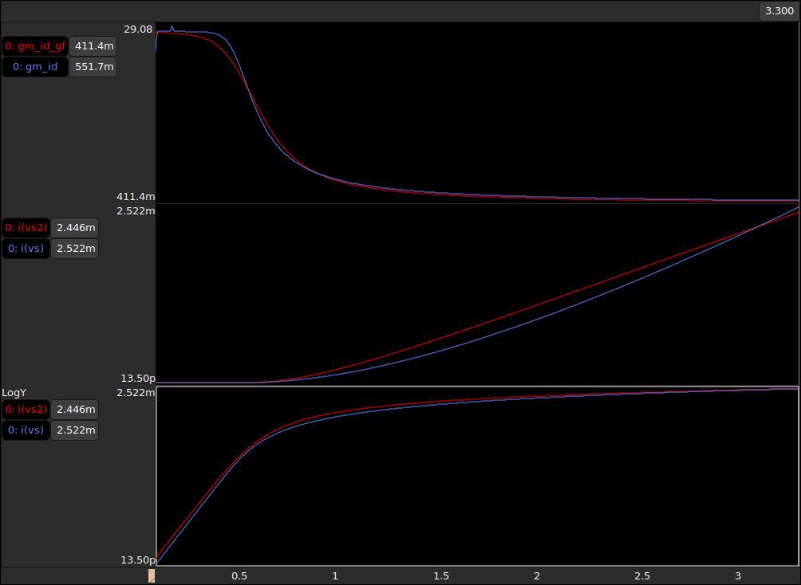

# GlobalFoundries GF180MCU Open Source PDK

The [ACM2V0](/Verilog-A/) model was tested using the open-source PDK [GF180mcu](https://github.com/google/gf180mcu-pdk#globalfoundries-gf180mcu-open-source-pdk), this PDK is a collaborative effort between Google and Global Foundries. The [xschem](/Examples/GF180MCU/xschem) folder contains the symbol and schematic files, along with the corresponding testbench to be used in xschem. 

Please note that it is essential to have the respective PDK installed and also the ".osdi" files ([learn more](/Verilog-A/openvaf/readme.md)) to work with the xschem files effectively.

### Plot for $g_{m}/I_{D}$ vs. $V_{G}$ and $I_{D}$ vs. $V_{G}$ on xschem+gaw(waveviewer)
  * Red: GF180mcu
  * Blue: ACM2V0

# ACM2V0 and GF180mcu on Google Colaboratory

Another convenient method to utilize the [ACM2V0](/Verilog-A/) model is on Google Colaboratory. The [environment](colab_ngspice/GF180MCU_ACM2V0.ipynb) is pre-equipped with ngspice, the ".osdi" conversion tool, [OpenVAF]((/Verilog-A/openvaf/readme.md)), and the installation of the GF180mcu PDK. Furthermore, an example netlist is already available, along with a Python script for plotting purposes.

