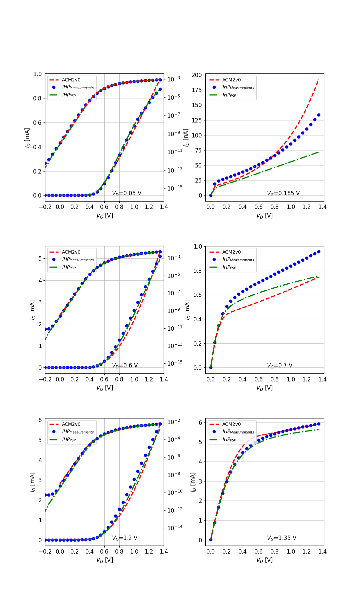

# IHP SG13G2 Open Source PDK

The [ACM2V0](/Verilog-A/) model was compared with measurements of the 130 nm biCMOS open-source PDK [IHP-SG13G2](https://github.com/IHP-GmbH/IHP-Open-PDK), as well as with MOS model provided by the PDK.

### Plots for $I_{D}$ vs. $V_{G}$ @ $V_D$ = 0.05, 0.6 and 1.2 V and $I_{D}$ vs. $V_{D}$ @ $V_G$ = 0.185, 0.7 and 1.35 V  

W/L = 10 um / 120 nm
 

