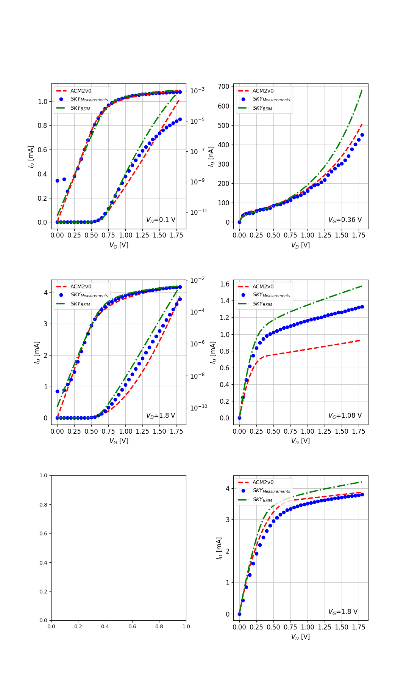

# Skywater 130 nm Open Source PDK

The [ACM2V0](/Verilog-A/) model was compared with measurements of the open-source PDK [SKY130](https://github.com/google/skywater-pdk), as well as with the PDK MOS model for two flavors of transistor SVT and LVT.
This PDK is a collaborative effort between Google and Skywater technology. 

### SVT -  Plots for $I_{D}$ vs. $V_{G}$ @ $V_D$ = 0.1 and 1.8 V and $I_{D}$ vs. $V_{D}$ @ $V_G$ = 0.36, 1.08 and 1.8 V  

W/L = 7 um/ 150 nm
 

### LVT -  Plots for $I_{D}$ vs. $V_{G}$ @ $V_D$ = 0.1 and 1.8 V and $I_{D}$ vs. $V_{D}$ @ $V_G$ = 0.36, 1.08 and 1.8 V  

W/L = 7 um/ 150 nm
 

# ACM2V0 and SKY130 on Google Colaboratory

Another convenient method to utilize the [ACM2V0](/Verilog-A/) model is on Google Colaboratory. The [colab notebook environment](SkyWater130nm_ACM2V0.ipynb) is pre-equipped with ngspice, the ".osdi" conversion tool, [OpenVAF]((/Verilog-A/openvaf/readme.md)), and the installation of the SKY130 PDK. Furthermore, an example netlist and a Python script for plotting are already available.

