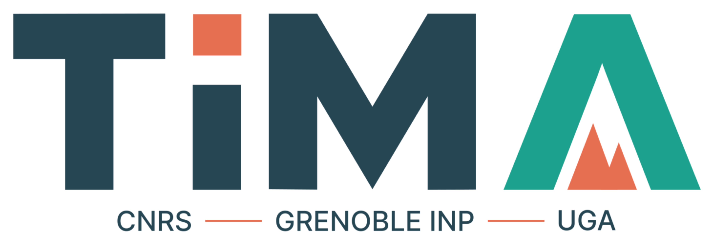

# Advanced Compact MOSFET model 2 (ACM2)
 ACM2 is a simple MOSFET model to design and simulate Analog, Mixed-Signal, and RF circuits
 
As of July 2023, this repository aims to release all future versions and provide technical support for the ACM2 model.

# Current Status
>
> The authors of this repository are treating the current content as a **pre-release**
>

# About ACM2
ACM2 is a charge-based physical model. All the large signal characteristics (currents and charges) and the small signal parameters ((trans)conductances and (trans)capacitances) are given by single-piece expressions in all regions of operation. It also preserves the transistor's structural source-drain symmetry.

The model is available for proprietary and open-source EDA tools due to the versatility of the Verilog-A language.
This repository presents the Verilog-A code for NMOS and PMOS transistors, documentation of the model in papers and reports, and a comparison of the model with PDK models or measurements for the three available open-source processes (Sky130, IHPSG13, and GF180MCU).

ACM2 can also be used for design-oriented circuit exploration, as illustrated by the resistive-feedback LNA design methodology available in this [Google Colab notebook](/Examples/Design%20Methodologies/RfeedbackLNA_design/LNA_design_with_ACM2_git2026.ipynb).

Further details on the ACM2 model formulation and implementation are available in the report below:

[ACM model Report](/docs/ACM_Report_Github.pdf)

## Citation

Researchers are kindly requested to include the following citation when using the ACM2 model in their research.

Main paper:

>D. G. A. Neto et al., "[Design-Oriented Single-Piece 5-DC-Parameter MOSFET Model](https://ieeexplore.ieee.org/document/10565864)," *IEEE Access*, vol. 12, pp. 87420–87437, 2024, doi: 10.1109/ACCESS.2024.3417316.

Github:

> D. G. A. Neto, M. C. Schneider, M. J. Barragan, S. Bourdel, and C. Galup-Montoro, “Advanced Compact MOSFET Model 2 (ACM2),” 2026. [Online]. Available: https://doi.org/10.5281/zenodo.20434089

## [Presentations](/docs/presentations/)

This section contains slides from tutorials and presentations related to the ACM2 model.

- [NEWCAS 2025 Tutorial](/docs/presentations/ACM2_NEWCAS_2025.pdf)
- [FSIC 2025 presentation](/docs/presentations/FSiC_2025_DGAN_ACM2.pdf)
- [ESSERC 2025 Tutorial](/docs/presentations/T2-Design_and_Simulation_of_Analog-RF_IC_ESSERC.pdf)

## Authors
[**Deni Germano Alves Neto**](https://www.linkedin.com/in/deni-alves-neto)¹⁺²  
**Márcio Cherem Schneider**¹  
**Manuel J. Barragan**²  
**Sylvain Bourdel**²  
[**Carlos Galup-Montoro**](https://www.linkedin.com/in/carlos-galup-montoro-6736185)¹  

### Affiliations

|  |  |
| :---: | :--- |
| 

 | ¹ Federal University of Santa Catarina, 88040-900 Florianópolis, Brazil. |
| 

 | ² Univ. Grenoble Alpes, Grenoble INP, CNRS, TIMA, 38000 Grenoble, France. |

---

More about the ACM model:
[Integrated Circuit Laboratory](https://lci.ufsc.br/) @ Universidade Federal de Santa Catarina

## Contact

Requests for more information about the ACM2 model or related information can be emailed to acmmodelgit@gmail.com

# License

The ACM model is released under the [ECL-2.0 license](LICENSE).

The copyright details are:
    
        Copyright 2023 Universidade Federal de Santa Catarina Licensed under the
        Educational Community License, Version 2.0 (the "License"); you may
        not use this file except in compliance with the License. You may
        obtain a copy of the License at

http://opensource.org/licenses/ECL-2.0

        Unless required by applicable law or agreed to in writing,
        software distributed under the License is distributed on an "AS IS"
        BASIS, WITHOUT WARRANTIES OR CONDITIONS OF ANY KIND, either express
        or implied. See the License for the specific language governing
        permissions and limitations under the License.
